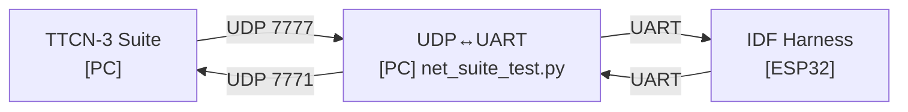

# iot-conformance

Conformance test workspace for IoT protocols.

Initial Projects

- TCP on Target (HW-in-the-loop)
  - TTCN-3 drives tests over UDP; a Python bridge forwards UDP to the device UART; the ESP-IDF harness runs on ESP32.
  - UDP ports: `7777` out (suite→device), `7771` in (device→suite).
  - Build harness (from `tcp/target/`):
    - `idf.py build`
    - `idf.py -p /dev/ttyUSB0 flash`
  - Start UART↔UDP bridge (from `tcp/suite/`):
    - `python3 net_suite_test.py --port /dev/ttyUSB0 --udp-in 7771 --udp-out 7777`
  - Run TTCN-3 (from `tcp/suite/`):
    - `ttcn3_start test_suite esp32_netsuite.cfg`

- MQTT on Host (Linux)
  - Build `esp-mqtt` for Linux and redirect its `tcp_transport` to UDP test ports; TTCN-3 uses IPL4asp UDP to validate CONNECT/CONNACK.
  - Prereqs: `sudo apt install eclipse-titan`; `git submodule update --init --recursive`.
  - Build TTCN-3 suite (from `mqtt/suite/`):
    - `./make.sh`
    - Run: `ttcn3_start mqtt_connect mqtt_connect.cfg`
  - Optional host client (from `mqtt/host/`):
    - `export IDF_PATH="$(pwd)/deps/idf" && . "$IDF_PATH/export.sh"`
    - `idf.py --preview set-target linux`
    - `idf.py build`
    - Configure env if needed: `MQTT_UDP_DST`, `MQTT_UDP_OUT=7777`, `MQTT_UDP_IN=7771`

Notes
- TITAN’s IPL4asp is vendored at `deps/titan.TestPorts.IPL4asp` and used by the MQTT suite.
